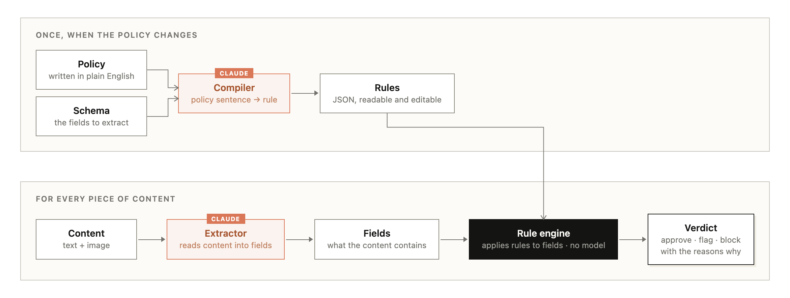

# Content policy enforcement with Claude

Turn a written content policy into rules a program can enforce.

## The problem

Content moderation is the process of checking content against a written policy before it
goes out, then deciding what happens to it: publish it, reject it, or send it to a human
reviewer. The content can come from anywhere. Users post comments, sellers create
listings, advertisers submit creatives, and your own marketing team drafts campaigns that
legal has to clear. The policy is a document written in plain English by a policy, legal,
or brand team. The content arrives continuously, often at volumes no human team can keep
up with.

The review has real constraints. Decisions have to be consistent: two identical
submissions can't get different answers. Rejections have to be explainable, because
submitters appeal and regulators ask. And the policy keeps changing (a new state
regulation, a new category of scam), so whatever enforces it has to change safely too.

## The usual approach

The natural first build with an LLM is to put the entire policy document in a prompt,
append the content, and ask for a verdict. It's a fine prototype, and it works in a demo.
At production volume it runs into all three constraints. The same content can get
different verdicts on different runs. The explanation for a rejection is whatever prose
the model happened to generate, which no reviewer can check line by line. And a policy
change is just a prompt edit: there is nothing to review, diff, or roll back, and every
past decision was made under a version of the prompt nobody recorded.

## What this cookbook does instead

Claude runs in exactly two places, and neither one decides the verdict:



- The **compiler** turns each policy clause into rules over a field schema you define.
  A static validator checks every rule against the schema and sends problems back to
  Claude to fix. Clauses that need judgment ("no one who looks under 25") become judged
  fields that get answered during extraction. Clauses that can't be checked at all are
  listed as uncompilable instead of quietly dropped.
- The **extractor** reads each submission, text and image, into typed fields with one
  API call. That call is the entire per-review cost.
- The **engine** is about 200 lines of plain Python with no model calls. It applies the
  rules to the fields and produces the verdict, with a trace showing which rules fired
  and why. Same inputs, same verdict, every time. Rules can be scoped to placement
  ("only in New Jersey"), and when the model couldn't determine something a rule needs,
  the submission goes to human review instead of getting a guess. Re-checking content
  under a different placement or a new ruleset version costs nothing.

Start with **[guide.ipynb](guide.ipynb)**. It is fully executed, so you can read the
outputs without running anything.

## What's in here

The pattern isn't tied to any one kind of content. Anywhere content gets checked against
a written policy fits: product listings, ad creatives, comments and reviews, job
postings, seller profiles, video and podcast metadata, marketing copy going through
legal or brand review. The cookbook works three of these end to end:

| Path | What it is |
|---|---|
| `guide.ipynb` | The cookbook: schema, rule language, engine, compiler, LLM assertions, extraction, adding rules from plain English, domain swap, evaluation |
| `engine.py`, `pipeline.py` | The rule engine and the two Claude stages; the guide imports them and shows the interesting parts |
| `data/ad_creatives/` | The worked example: schema, policy document, a hand-written reference ruleset, labeled samples, and synthetic creative images (`build_creatives.py` regenerates them) |
| `data/product_listings/` | Second domain: marketplace listings (counterfeits, medical claims, off-platform payment, seller-tier rules) |
| `data/ugc/` | Third domain: comments and reviews (harassment, PII, spam) |
| `evaluation/run_eval.py` | Runs the whole pipeline against the labeled samples in all three domains |

All companies and brands in the data are made up, and the creative images are generated
with Pillow, so the ground-truth labels are correct by construction and nothing here
resembles a real advertiser.

## How well it works

On the 22 labeled samples across the three domains, the pipeline gets 21 decisions right.
The one miss is a genuinely borderline comment (a new account linking their own blog:
promotional or not?), and the notebook walks through why it happens and how to fix it:
you sharpen one field description in the schema, not the rules or the engine.

## Run it

```bash
# from the repo root (or standalone: pip install anthropic python-dotenv)
uv sync --all-extras
# from capabilities/content_moderation/, runs the full 22-sample evaluation:
python evaluation/run_eval.py
```

The notebook's own evaluation cell runs 2 samples per domain by default to keep it cheap;
set `RUN_FULL_EVAL=1` for the full table. A default notebook run takes about 10 to 15
minutes and costs on the order of a dollar.

## When to use this

It fits when the policy is yours and changes often, when verdicts have to be explained to
submitters or auditors, when the same content gets re-checked across placements or policy
versions, and when the people who own the policy aren't engineers.

It's the wrong tool for standard single-category detection like CSAM or violence, where
dedicated classifiers are the right choice. And it's overkill for one-off classification
with no policy-change story, where a single classification prompt does the job.
